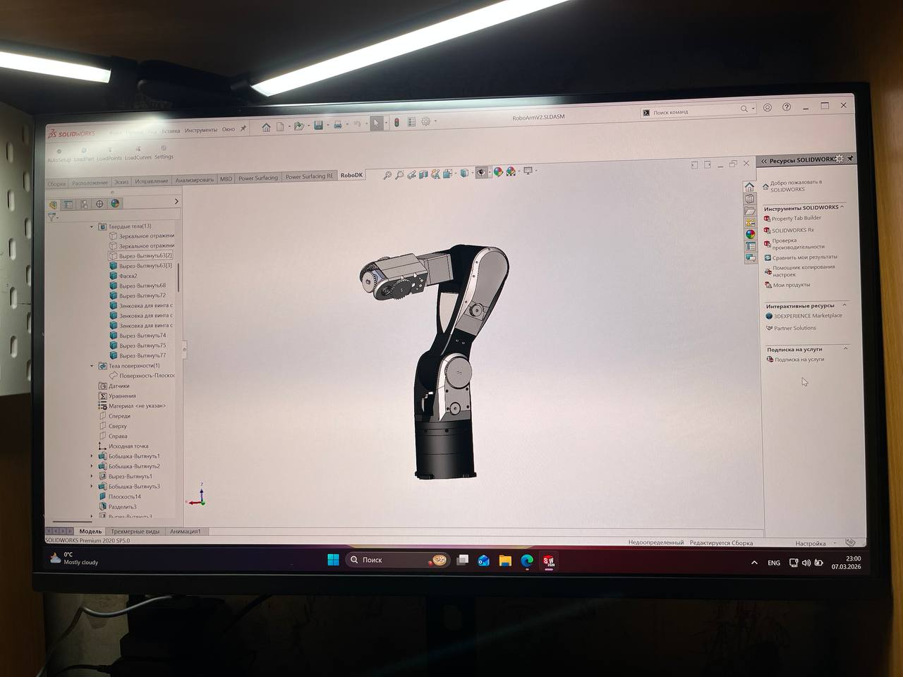

# 6-DOF 3D-Printed Robotic Arm

Welcome to the repository for my custom 6-axis robotic arm manipulator. This project involves mechanical design, 3D printing, electronics, and inverse kinematics (IK) calculations.

 *(Here you can find the main photo)*

## Project Structure
* `/Images` — Photos, CAD renders. Updates are coming soon!

##  Current Status
* **Mechanics:** 100% assembled (3D-printed parts, stepper motors).
* **Electronics:** Wired and tested.
* **Firmware:** Currently working on object recognition system. Updates are coming soon!
