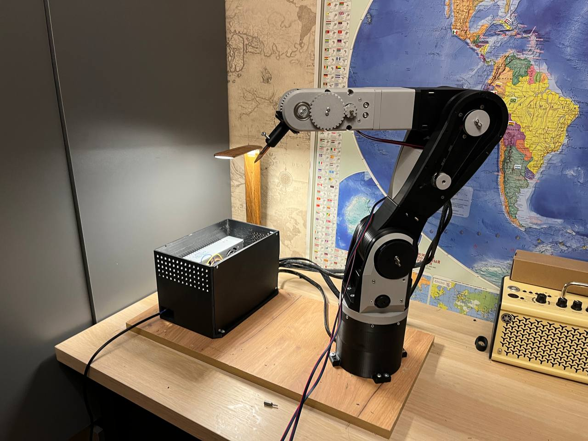

# 6-DOF 3D-Printed Robotic Arm

Welcome to the repository for my custom 6-axis robotic arm manipulator. This project involves mechanical design, 3D printing, electronics, and inverse kinematics (IK) calculations.
 *Note: I am currently working on this project. Have not upload the files, wait for updates

 
 
## Project Structure
* `/Images` — Photos, CAD renders. Updates are coming soon!
* [RoboArm.STL](./RoboArm.STL) — 3D model of the project. Click to view interactive 3D model directly in browser.

##  Current Status
* **Mechanics:** 100% assembled (3D-printed parts, stepper motors).
* **Electronics:** Wired and tested.
* **Firmware:** Currently working on object recognition system. Updates are coming soon!

## 📐 CAD Gear Naming Rules

### Format
`J{joint_number}_{TypeOfGear}_T{NumberOfTeeth}`

### Definitions
* **`joint_number`**: `1`, `2`, `3`, `4`, `5`, `6`
* **`TypeOfGear`**:
  * `Drive` — Motor shaft gear
  * `Driven` — Secondary gear
  * `Idler` — Intermediate gear
  * `Output` — Final joint gear
  * `Bevel` / `Compound` / `Cycloidal` — Specific gear types
* **`NumberOfTeeth`**: Tooth count (`T10`, `T30`, or `T30_T10` for compound)

### Examples
* `J5_Drive_T10`
* `J5_Idler_T10`
* `J5_Driven_T30`
* `J5_CompoundBevel_T30_T10`
* `J5_Output_T60`
